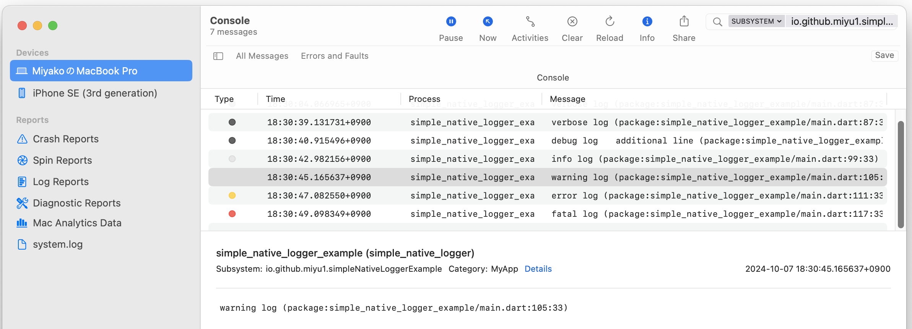
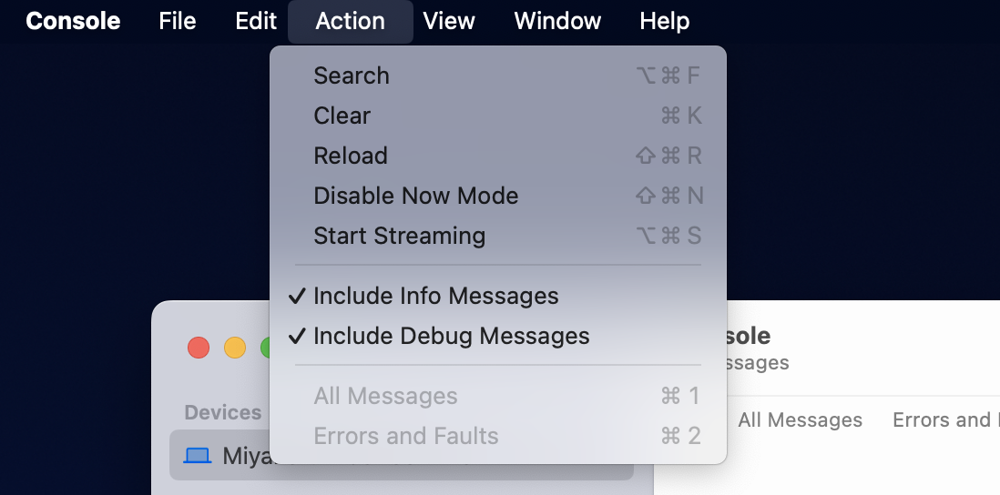

# Native Logger

Android has logcat system for application logging,
and macOS/iOS also has similar logging system.

Native logger is flutter plugin to put logs to these platform native logging system.

| |Android|macOS|iOS|
-|-|-|-
| Support |all| 11.0+ | 14.0+ |

On Android, you can see the logs using adb command.

```
$ adb shell 'logcat -v time --pid=$(pidof -s io.github.miyu1.native_logger_example)'
10-05 19:03:05.916 V/MyApp   (22099): verbose log
10-05 19:03:07.849 D/MyApp   (22099): debug log
10-05 19:03:07.849 D/MyApp   (22099): 	additional line
10-05 19:03:11.140 I/MyApp   (22099): info log
10-05 19:03:14.740 W/MyApp   (22099): warning log
10-05 19:03:16.650 E/MyApp   (22099): error log
10-05 19:03:19.449 E/MyApp   (22099): fatal log
```

On macOS/iOS, you can see the logs using macOS Console app,
  

or by log command.
(For iOS simulator, run 'xcrun simctl spawn booted log' command with same parameter.)

```
$ log stream  --level debug --predicate 'subsystem = "io.github.miyu1.nativeLoggerExample"'
Filtering the log data using "subsystem == "io.github.miyu1.nativeLoggerExample""
Timestamp                       Thread     Type        Activity             PID    TTL  
2024-10-06 00:31:18.068529+0900 0x13983    Debug       0x0                  5224   0    native_logger_example: (native_logger) [io.github.miyu1.nativeLoggerExample:MyApp] verbose log
2024-10-06 00:31:20.432184+0900 0x13983    Debug       0x0                  5224   0    native_logger_example: (native_logger) [io.github.miyu1.nativeLoggerExample:MyApp] debug log
	additional line
2024-10-06 00:31:22.347631+0900 0x13983    Info        0x0                  5224   0    native_logger_example: (native_logger) [io.github.miyu1.nativeLoggerExample:MyApp] info log 
2024-10-06 00:31:23.780923+0900 0x13983    Default     0x0                  5224   0    native_logger_example: (native_logger) [io.github.miyu1.nativeLoggerExample:MyApp] warning log 
2024-10-06 00:31:24.963804+0900 0x13983    Error       0x0                  5224   0    native_logger_example: (native_logger) [io.github.miyu1.nativeLoggerExample:MyApp] error log 
2024-10-06 00:31:26.213910+0900 0x13983    Fault       0x2c32f              5224   0    native_logger_example: (native_logger) [io.github.miyu1.nativeLoggerExample:MyApp] fatal log 
```

## Usage

```dart
import 'package:native_logger/native_logger.dart';

void main() {
  NativeLogger.init();
  ...
}
  ...
  final _nativeLogger = NativeLogger(tag: "MyApp");
  _nativeLogger.w("<log message>");

  try {
    ... 
  } catch (ex, stack) {
    _nativeLogger.e(ex, stack: stack);
  }
```

To use native_logger, you have to call NativeLogger.init() once, may be in main.  
Then anywhere in code, you can use NativeLogger class for logging.  
You can also pass optional stack trace parameter.

Following table lists NativeLogger methods and corresponding method on each platform. 

| native_logger | android | iOS/macos | 
-|-|-
| NativeLogger.v | Log.v | Logger.debug |
| NativeLogger.d | Log.d | Logger.debug |
| NativeLogger.i | Log.i | Logger.info |
| NativeLogger.w | Log.w | Logger.notice |
| NativeLogger.e | Log.e | Logger.error |
| NativeLogger.f | Log.wtf | Logger.fault |

On Android, android.util.Log class is used to implement.  
'tag' parameter of NativeLogger is used as tag parameter of the Log class.  
Log.isLoggable is also called before log.

On macOS/iOS, os.Logger class is used to implement.  
'tag' parameter of NativeLogger is used as category parameter of the Logger class.  
subsystem parameter is fixed to bundle ID.

Other constructor parameters are following:

**logLevel** is to suppress lower level logs.  
For example, if LogLevel.error is set, error and fatal logs are outputted,
but verbose, debug, info and warning logs are not.  
Default value is LogLevel.verbose that all logs are outputted.

**stackCount** is used when optional stack trace parameter is
passed to loggging methods.  
Stack trace depth in log message is limited to stackCount value.  
If stackCount is munis value, full stack is logged.

If **addLineNumber** is set to true,
source filename and line number is appended to log.  
If stack trace parameter is passed to loggging methods, this parameter is ignored.

## Notice for Android

By default, verbose and debug log is not shown.  
Use adb command to change behavior.  
Currently android log is also shown to flutter console, and the adb settings also affects to it.

```
$ adb shell
emu64xa:/ $ setprop log.tag.MyApp V
emu64xa:/ $ exit
$ flutter run
...
V/MyApp   (32405): verbose log (package:native_logger_example/main.dart:87:33)
D/MyApp   (32405): debug log
D/MyApp   (32405): 	additional line (package:native_logger_example/main.dart:93:33)
I/MyApp   (32405): info log (package:native_logger_example/main.dart:99:33)
W/MyApp   (32405): warning log (package:native_logger_example/main.dart:105:33)
E/MyApp   (32405): error log (package:native_logger_example/main.dart:111:33)
E/MyApp   (32405): fatal log (package:native_logger_example/main.dart:117:33)
```

MyApp is a tag parameter I used in exmaple app.
Change it to your own.  

To reset,
```
$ adb shell  
emu64xa:/ $ setprop log.tag.MyApp ""
emu64xa:/ $ exit
```
## Notice for macOS/iOS
By default, verbose, debug and info log is not shown by console app or log command.  
To change this behavior on console app, use Action menu of it.

 

For log command, and '--level debug' option.

Currently, macOS/iOS logs are not shown in flutter console.  
So I added code to show logs to flutter console.
isEchoNeeded and echo method of NativeLogger do the job. 

```
$ flutter run
flutter: [MyApp:V] verbose log (package:native_logger_example/main.dart:87:33)
flutter: [MyApp:D] debug log
flutter: 	additional line (package:native_logger_example/main.dart:93:33)
flutter: [MyApp:I] info log (package:native_logger_example/main.dart:99:33)
flutter: [MyApp:W] warning log (package:native_logger_example/main.dart:105:33)
flutter: [MyApp:E] error log (package:native_logger_example/main.dart:111:33)
flutter: [MyApp:F] fatal log (package:native_logger_example/main.dart:117:33)
```
