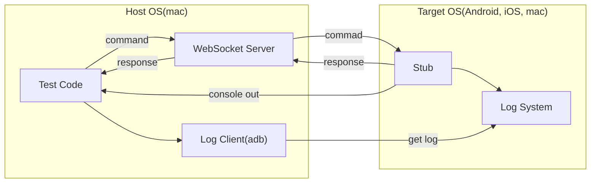

# How to run test code

Test codes in this directory is for integration test of the plugin,
not for test of this example app.

Test codes are:
  - android_integration_test.dart
  - ios_integration_test.dart
  - macos_integration_test.dart

for each platform.

Android integration test runs on real device if connected,
use Android emulator if not.

iOS integration test always run on iOS emulator on macos.

So you need to configure emulator or connect device for Android/iOS test.

MacOS integration test runs os macos.

Test fails when run on concurrent, so please run test with
```
$ flutter test -j 1
```

# Test code structure

Integration test runs with several processses.

Following is structure.



Stub code is integration_test/test_stub.dart

WebSocket Server is websocket_server.dart

Because some test code runs on host OS and others in target OS,
these integration test code is in test directory, not in integration_test. 